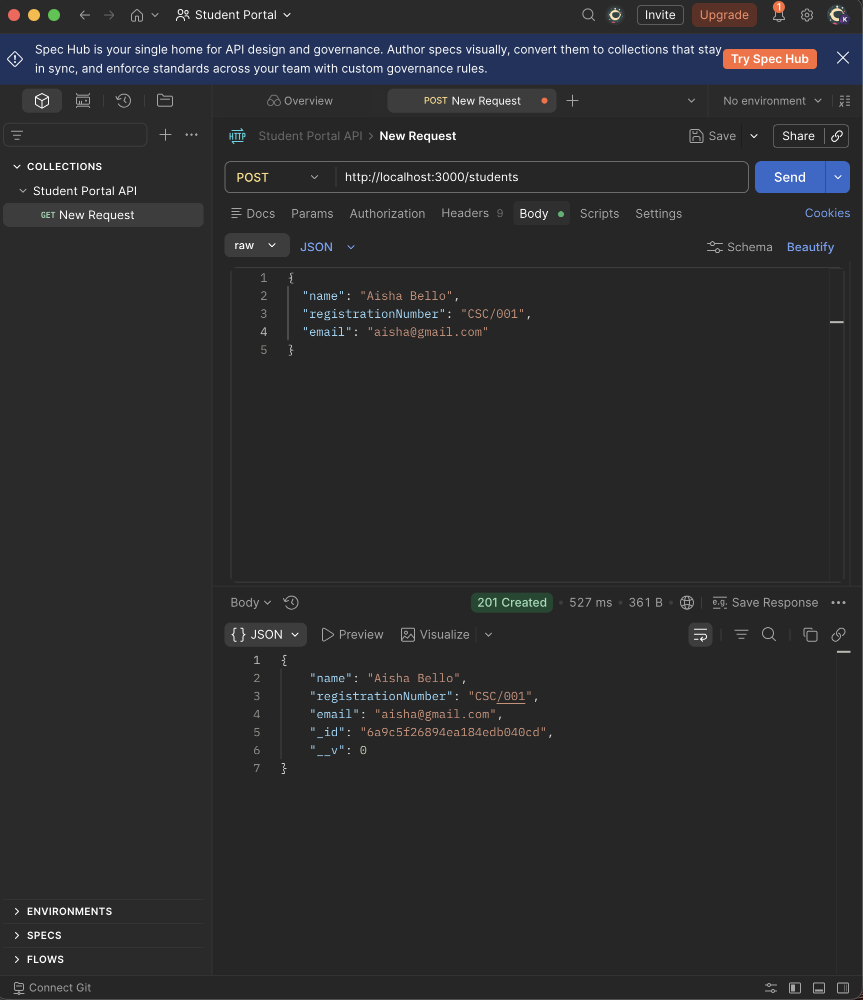
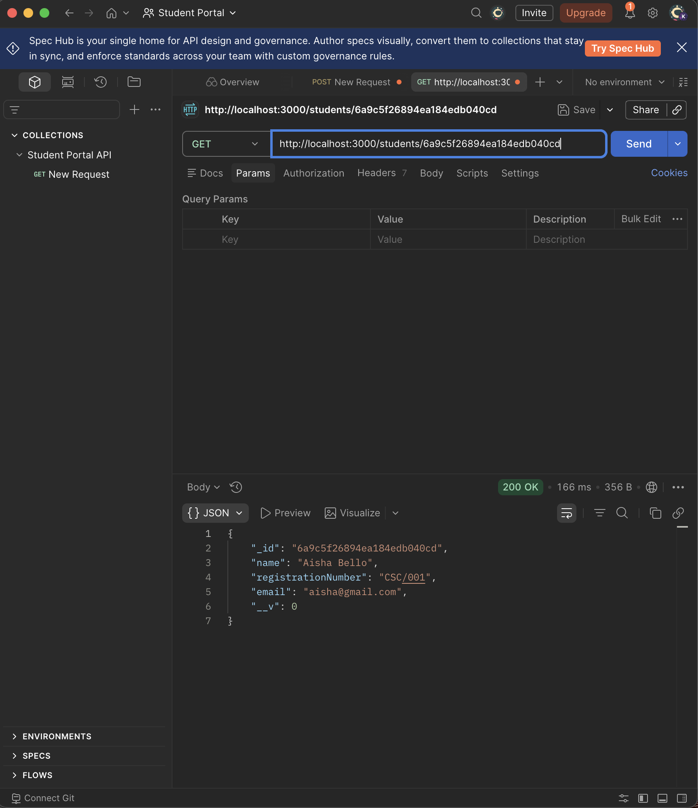
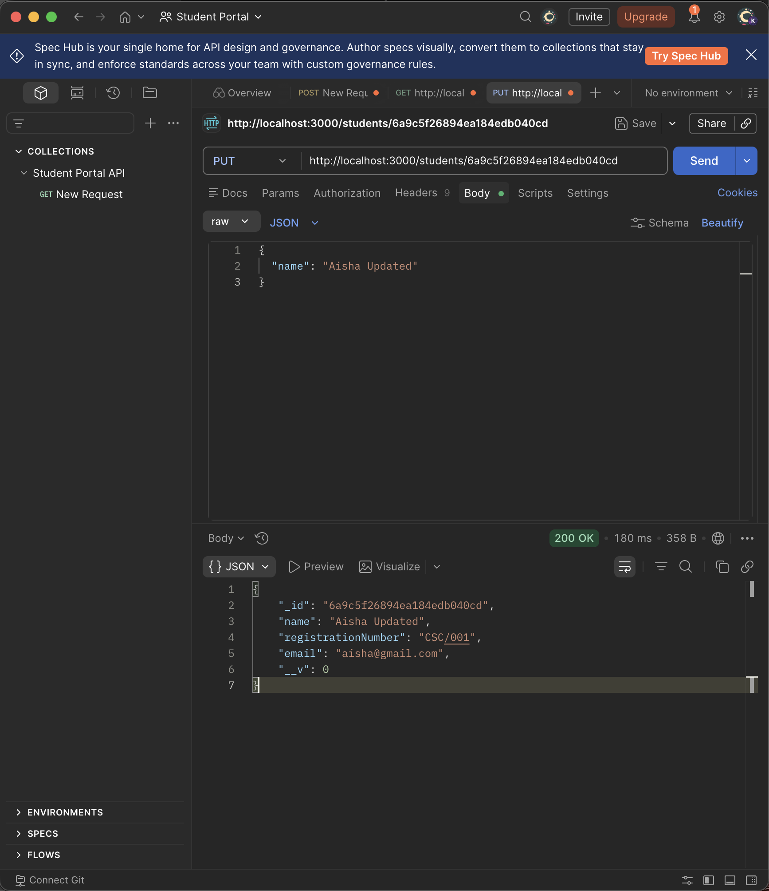
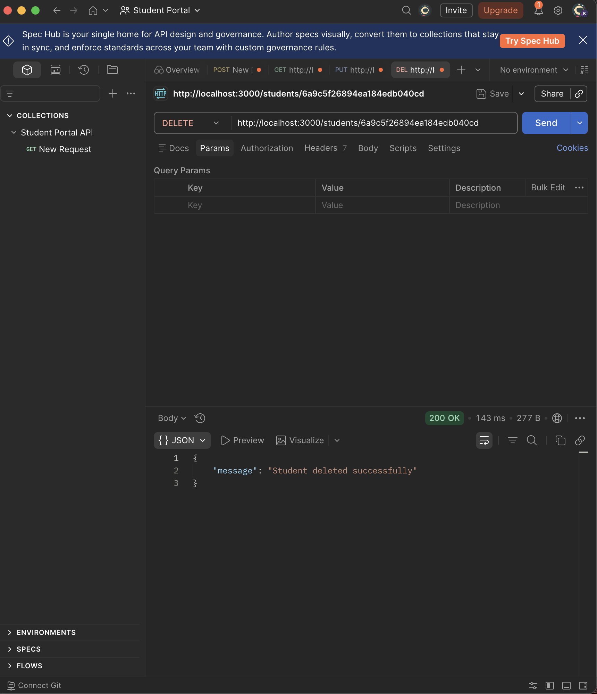

# 🎓 Student Portal API

A simple REST API I built for my Backend Development assignment.

The goal was to build a Student Portal where students can create an account, view their details, update their name, and delete their account.

I built this project using **Node.js, Express.js, MongoDB, and Mongoose**.

This project also helped me understand how the different parts of a backend application work together instead of just writing code that "works."

---

## 🚀 What This API Does

The Student Portal API supports the four basic CRUD operations:

| Operation | HTTP Method | Endpoint        | What it does               |
| --------- | ----------- | --------------- | -------------------------- |
| 🟢 Create | `POST`      | `/students`     | Creates a student account  |
| 🔵 Read   | `GET`       | `/students/:id` | Gets a student's details   |
| 🟡 Update | `PUT`       | `/students/:id` | Updates the student's name |
| 🔴 Delete | `DELETE`    | `/students/:id` | Deletes a student account  |

---

# 🧠 What I Learned Building This

Before building this project, CRUD sounded more complicated than it actually is.

The basic idea is:

```text
CREATE → Add something
READ   → Get something
UPDATE → Change something
DELETE → Remove something
```

For this project, the "something" is a **student**.

So:

```text
POST   → Create a student
GET    → Read a student
PUT    → Update a student
DELETE → Delete a student
```

---

# 🏗️ Project Architecture

The final structure of my backend is:

```text
Postman / Client
       ↓
     Routes
       ↓
   Controllers
       ↓
      Model
       ↓
    MongoDB
```

### In simple language

I think of the backend like a restaurant 🍽️:

* **Postman** is the customer placing an order.
* **Routes** are the receptionist or waiter who receives the request.
* **Controllers** are the people who actually handle the request.
* **Models** are the rules or blueprint for the data.
* **MongoDB** is where the information is stored.

This separation makes the application easier to understand and maintain.

---

# 📁 Project Structure

```text
student-portal-api/
│
├── src/
│   │
│   ├── config/
│   │   └── database.mjs
│   │
│   ├── controllers/
│   │   └── studentController.mjs
│   │
│   ├── models/
│   │   └── student.mjs
│   │
│   ├── routes/
│   │   └── studentRoutes.mjs
│   │
│   └── server.mjs
│
├── screenshots/
│   ├── create-student.png
│   ├── get-student.png
│   ├── update-student.png
│   ├── delete-student.png
│   ├── server:active.png
│   ├── server:running.png
│   ├── server:mongodb:active.png
│   ├── studentportal:postman.png
│   └── Installs.png
│
├── .gitignore
├── package.json
├── package-lock.json
└── README.md
```

---

# 📂 Understanding the Folders

## `config/` ⚙️

This contains the database connection.

### `database.mjs`

This file connects my Node.js application to MongoDB using Mongoose.

I separated the database connection from the server because I don't want everything living inside one giant file.

---

## `models/` 📋

### `student.mjs`

This contains the Student model.

The model defines the information a student should have:

```text
Name
Registration Number
Email
```

I think of the model as a **blueprint**.

If I'm building a house, the blueprint tells me what the house should look like.

The Student model does something similar for student data.

---

## `routes/` 🛣️

### `studentRoutes.mjs`

This file defines the API endpoints.

The routes answer the question:

> "When this type of request comes in, where should it go?"

For example:

```js
router.post('/', createStudent);
```

means:

> When someone sends a POST request to `/students`, send it to the `createStudent` controller.

The route itself doesn't need to contain all the database logic anymore.

---

## `controllers/` 🧠

### `studentController.mjs`

This is where the actual work happens.

It contains the logic for:

```text
createStudent
getStudent
updateStudent
deleteStudent
```

### Why did I add a controller?

Initially, the CRUD logic was directly inside my routes.

That works for a small project, but it can become messy as an application grows.

For example, imagine having:

```text
Student routes
Teacher routes
Course routes
Department routes
Authentication routes
```

If all the logic is inside the routes, those files can become very long.

So I separated the responsibilities.

Now:

```text
Routes → Direct the request
Controllers → Handle the logic
Models → Handle the data structure
Database → Stores the data
```

This makes the code easier to organize and maintain.

---

# 🍃 MongoDB

I used **MongoDB** as the database for this project.

MongoDB stores information as documents.

A student document can look like:

```json
{
  "name": "Aisha Bello",
  "registrationNumber": "CSC/001",
  "email": "aisha@gmail.com"
}
```

MongoDB also generates an `_id` for each student.

That ID is important because it allows the API to identify a specific student.

---

# 🔌 Mongoose

I used **Mongoose** to communicate between my Node.js application and MongoDB.

In simple terms:

```text
Node.js
   ↓
Mongoose
   ↓
MongoDB
```

Mongoose makes it easier for my application to work with MongoDB documents and models.

---

# 🔐 Environment Variables

My MongoDB connection string is stored in a `.env` file.

Example:

```text
MONGO_URI=your_mongodb_connection_string
```

I did not hard-code my database credentials into my application.

The `.env` file is also included in `.gitignore`.

This means my MongoDB password is not pushed to GitHub. 🔒

---

# 🟢 1. CREATE Student

### Endpoint

```http
POST /students
```

### Request body

```json
{
  "name": "Aisha Bello",
  "registrationNumber": "CSC/001",
  "email": "aisha@gmail.com"
}
```

The API receives the information and sends it to the Student model, which creates the student in MongoDB.

MongoDB then gives the student a unique `_id`.

### Screenshot



---

# 🔵 2. GET Student

### Endpoint

```http
GET /students/:id
```

Example:

```http
GET /students/6a9c5f26894ea184edb040cd
```

The `:id` is a **route parameter**.

Inside the controller, I can access it using:

```js
req.params.id
```

The API uses that ID to find the student in MongoDB.

If the student doesn't exist, the API returns:

```json
{
  "message": "Student not found"
}
```

### Screenshot



---

# 🟡 3. UPDATE Student

### Endpoint

```http
PUT /students/:id
```

The assignment had an important restriction:

> Students can only update their name.

So the request body is:

```json
{
  "name": "Aisha Updated"
}
```

The controller only takes the `name` from the request:

```js
const { name } = req.body;
```

and updates only that field.

Therefore:

```text
Name                 ✅ Can change
Registration Number  🔒 Cannot change
Email                🔒 Cannot change
```

This was one of the important requirements I had to make sure the API followed.

### Screenshot



---

# 🔴 4. DELETE Student

### Endpoint

```http
DELETE /students/:id
```

Example:

```http
DELETE /students/6a9c5f26894ea184edb040cd
```

The controller finds the student using the ID and removes the record from MongoDB.

The API then responds:

```json
{
  "message": "Student deleted successfully"
}
```

### Screenshot



---

# 🧪 Testing With Postman

I used Postman to test the API locally.

The testing process was:

```text
POST
 ↓
Create student
 ↓
Copy MongoDB _id
 ↓
GET student
 ↓
PUT student name
 ↓
DELETE student
```

I also tested the API after deletion to confirm that the student could no longer be found.

### Test Results

```text
CREATE  ✅
GET     ✅
UPDATE  ✅
DELETE  ✅
```

---

# 🖥️ Running the Server

The application runs locally on:

```text
http://localhost:3000
```

To start the server:

```bash
node src/server.mjs
```

If the database connection is successful, the terminal shows:

```text
Server is running on http://localhost:3000
MongoDB connected successfully
```

---

# 📦 Installing Dependencies

After cloning the project:

```bash
npm install
```

The main packages used are:

* Express
* Mongoose
* dotenv

---

# 🔒 Security

The following files are ignored by Git:

```text
.env
node_modules
.DS_Store
```

The `.env` file contains sensitive database connection information, so it should never be committed to GitHub.

---

# 📸 Project Screenshots

## Server Running


## MongoDB Connection


## Postman


## Create Student


## Get Student


## Update Student


## Delete Student


---

# 🎯 Assignment Requirements

| Requirement                   | Status |
| ----------------------------- | ------ |
| Create student account        | ✅      |
| Student name                  | ✅      |
| Registration number           | ✅      |
| Email address                 | ✅      |
| Get student details by ID     | ✅      |
| Update student profile        | ✅      |
| Only allow name to be updated | ✅      |
| Delete student account        | ✅      |
| MongoDB database              | ✅      |
| REST API                      | ✅      |
| Postman testing               | ✅      |
| GitHub repository             | ✅      |
| Controller structure          | ✅      |

---

# 💭 Final Reflection

This project helped me understand that building a backend is not just about making an endpoint return a response.

I learned how the pieces connect:

```text
Client
  ↓
Express
  ↓
Routes
  ↓
Controllers
  ↓
Models
  ↓
MongoDB
```

I also learned why separating these responsibilities matters.

At first, I had the CRUD logic directly inside the routes. Later, I introduced a controller layer so that the routes could focus on directing requests while the controllers handled the actual work.

I also got practical experience with MongoDB, Mongoose, environment variables, route parameters, Postman testing, Git, and GitHub.

Most importantly, I built the API while learning what each part actually does instead of just copying a finished project.

🚀 **Student Portal API completed.**
